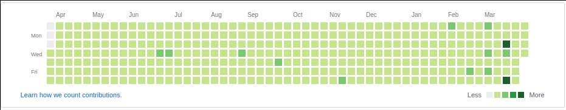

# 10xer

Today, I become a 10xer and I wanted to give back to the community.
So I created this to help others become 10xers like me.

Do you want your Github (and your future!) to look as green as this:



Then look no more! Use my script (and my knowledge!) to find the inner
10x in you.

# Instructions (for future 10xers)

I am not going to give the instructions for cloning because remember:
_If you can't think like a 10x, you can never be a 10x_

```
$ go run main.go
```

This creates the most awesome project ever in a folder, you can now push
that to Github for the monies and the cariyars.

# Instructions (for the others)

Just run `10xer` and see if it works out. Not everyone is capable, son.

## But my fellow 10xer, this only commits the 10x code, not push it!

Well, most 10xers don't write complete code, they wait for other 10xers
to send PRs. Get working!

## Features

- Zero Error Checking (10xers generally don't have to deal with errors)
- Single Responsbility Principle used exclusively
- Avoiding using For Loops and instead good old LABELS!

## What can you work on?

- Even though empty commits are along enough to 10x, files should be committed too!
- Auto Push to Github
- Dockerize this! (and then Kubernetes, not before, my friend!)

# Why?

Because I am learning Go _and it's April Fool's_
Inspired by [RockStar](https://github.com/avinassh/rockstar)